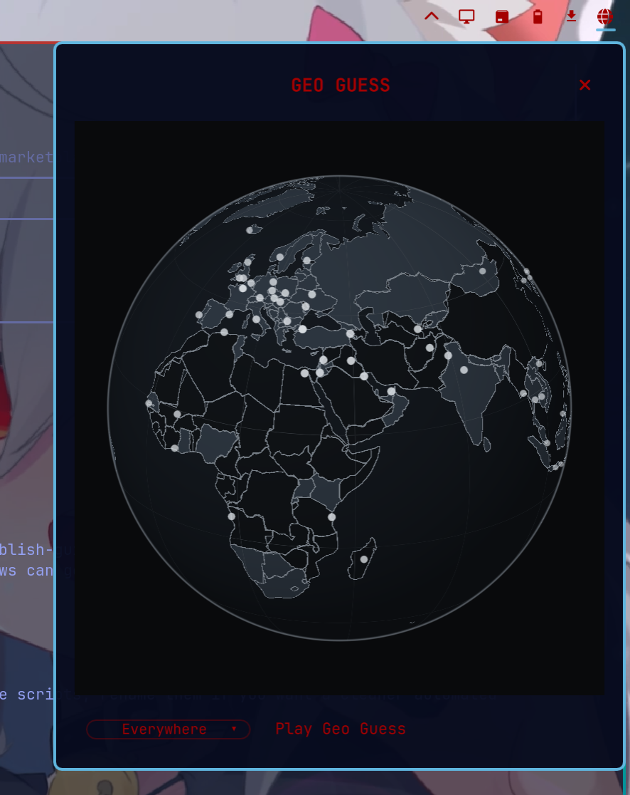

# Geo Guess



GeoGuess is a google streetview explorer and geolocation game, that uses a chromium extension to locally modify google streetview using no other apis or keys.

---

# AI written

## Install

```sh
omarchy plugin add https://github.com/LessUnderRated/geoguess.git --enable
```

## Usage

Click the globe on the bar to open or close the panel. Press Escape to close it. Middle-click the bar icon for a random treasure.

## Configure

Guess chrome lives in `guess-hide/`. Load that folder yourself with Chromium `--load-extension` if you want it. The optional native host is `scripts/install-guess-host.sh`. Neither runs on plugin add.

Needs Python 3, network access to Google Maps / Street View, and `omarchy-launch-webapp`. No sudo. Plugin add does not overwrite user config.

## Remove

```sh
omarchy plugin remove lessunderrated.geoguess
```
